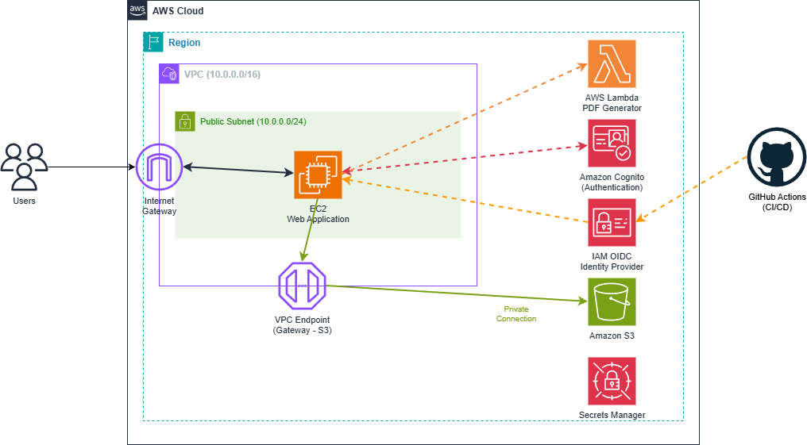

# Range Village Cloud Range 2026 Public

Required Tools:
* [AWS CLIv2](https://docs.aws.amazon.com/cli/latest/userguide/getting-started-install.html)
* [Pacu][https://github.com/RhinoSecurityLabs/pacu]

The tools come prepackaged in PwnedLabs [PwnedCloudOS](https://pwncloudos.pwnedlabs.io/). PwnCloudOS is a multi-cloud security platform for red and blue teamers.

## Lab Sheet
[lab-sheet.md](lab-sheet.md)

## AWS Architecture Diagram

